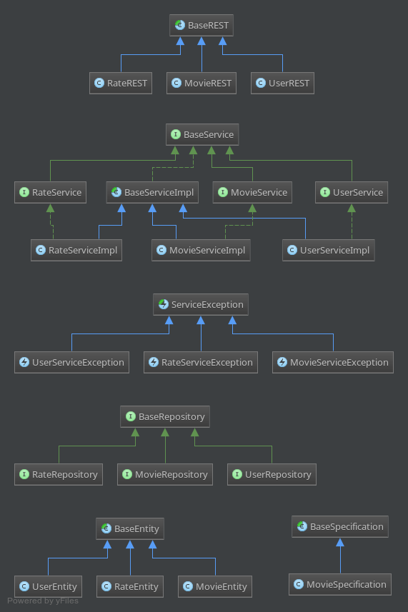

This project is a solution for [TASK.md](./TASK.md) (please review [TASK.md](./TASK.md) at first)

## How to use
You can find a **postman** dump in root of project as `./MovieArchive.postman_collection.json`. Import it into your chrome's **Postman** and check most available endpoints.

Here is the class diagram for the implementation:

